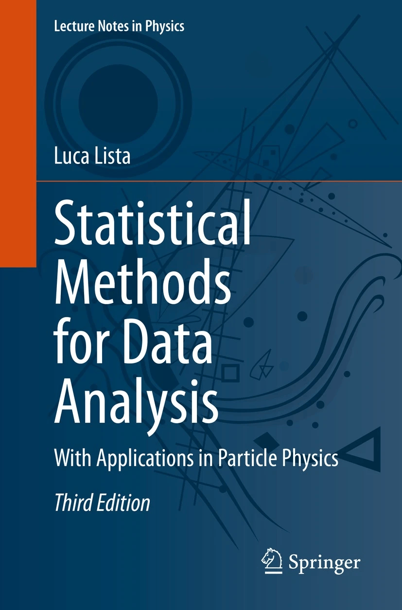
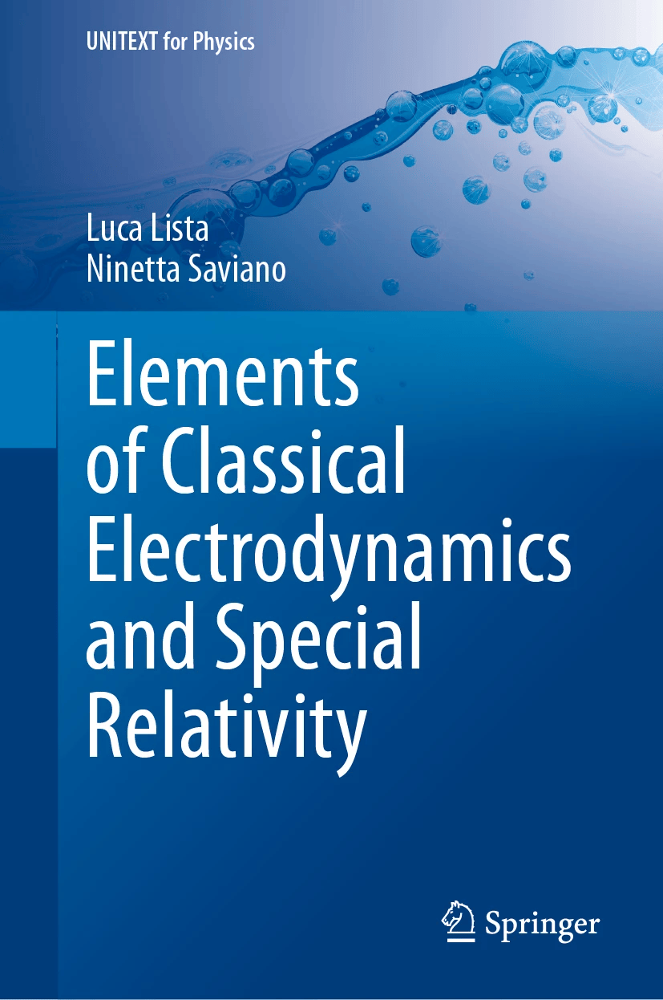

# Luca Lista

**Professor of Experimental Particle Physics · University of Naples Federico II**  
**INFN — Istituto Nazionale di Fisica Nucleare, Naples**

I am a particle physicist working on experimental data analysis, statistical methods, and scientific software.

## Professional

* [INFN](https://www.infn.it): [Luca Lista](https://people.na.infn.it/~lista/)
* [University of Naples Federico II](https://www.unina.it/): [Luca Lista](https://www.docenti.unina.it/luca.lista)
* [ORCID](https://orcid.org/0000-0001-6471-5492)
* [Google Scholar](https://scholar.google.com/citations?user=jDvqh5wAAAAJ&hl=en)
* [LinkedIn](https://www.linkedin.com/in/lucalista/)
* [GitHub](https://github.com/lucalista)

## Books

 

## Software

### Shine Stacker

Open-source focus-stacking software for macro photography and microscopy.

* [GitHub repository](https://github.com/lucalista/shinestacker/)
* [PyPI](https://pypi.org/project/shinestacker/)
* [Documentation](https://shinestacker.readthedocs.io/)

## Interests

Physics · Software · Statistics · Photography
Macro imaging · Amber fossil inclusions · Numismatics · Naples

---

*This is my personal website. For my academic profile and institutional information, please see my [INFN page](https://people.na.infn.it/~lista/).*
